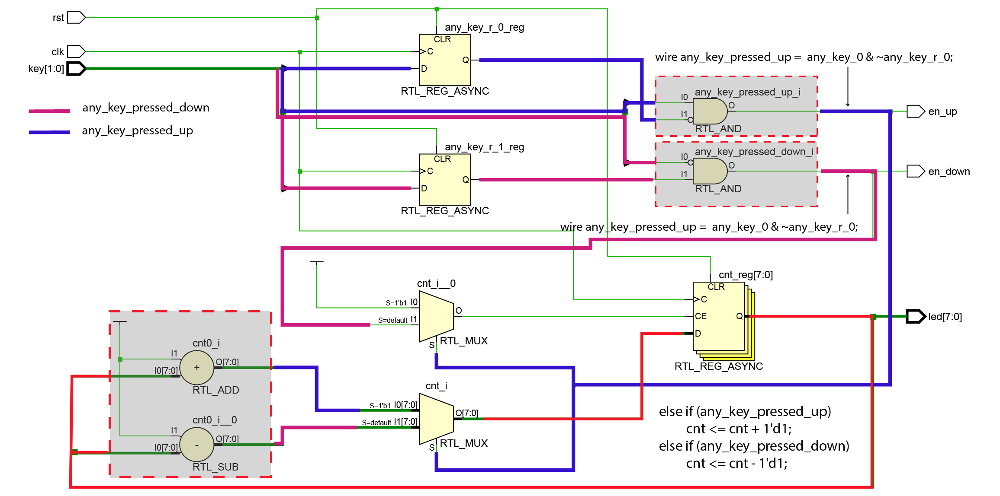

#  Key-controlled counter

Now let's modify our LED counter.

Now, when we press one button, the counter will increase by exactly 1, and if we press another button, it will decrease by 1.

In this case, we need to solve another problem: how to ensure that pressing the button increments the counter only once? For the counter, the time it takes for us to press and release the button is quite long in terms of clock cycles. As a reminder, our counter operates at a frequency of 50 MHz, which means 50 million clock cycles per second.

Therefore, we need to generate a signal that will tell the counter to increment its value when the button is pressed,and decrementation when the button is released.

To generate such a signal, we will use the fact that a certain number of clock cycles will pass while pressing the button. We will set up a flip-flop that will latch the logical level of the button press signal, and at the moment when the logic level changes from low to high or from high to low, we will send a signal to the counter, indicating that it should update its value at that precise moment.
# *RTL Analisys*

# *Simulation*

